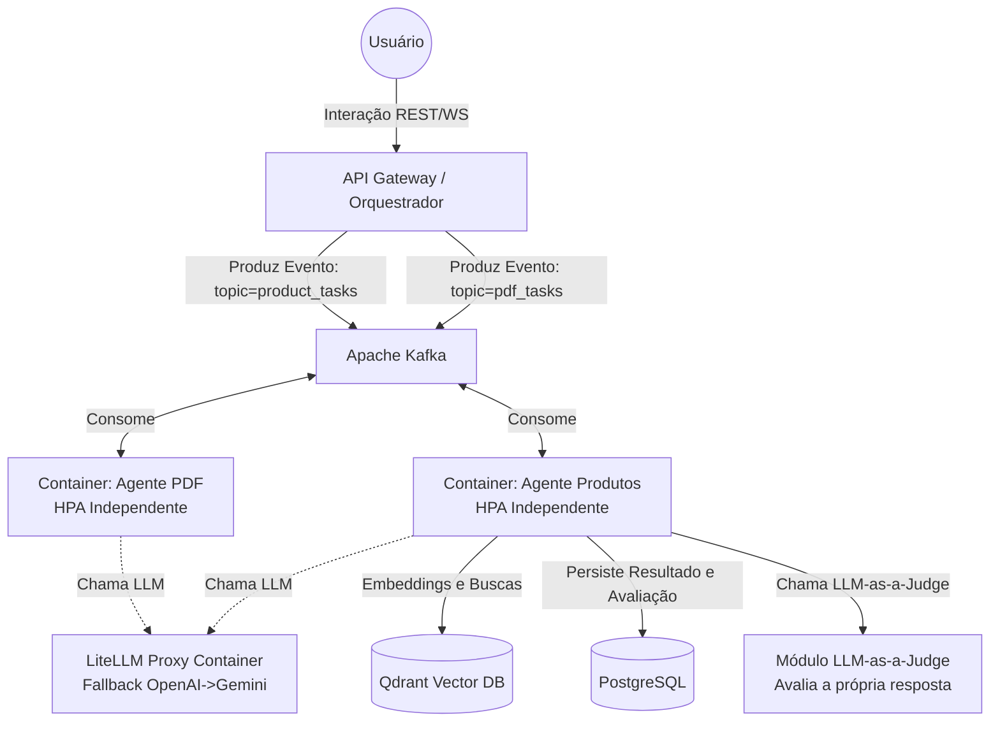

# Plano de Arquitetura: Microserviços de IA Escaláveis

## 1. Visão Geral da Arquitetura e Stack Tecnológico

A arquitetura Multi-Agentes evoluiu para um modelo totalmente assíncrono e orientado a eventos, integrando armazenamento vetorial de alta performance e bancos relacionais robustos.

**Stack Definida:**
*   **Orquestrador e Sub-agentes:** Python (LangGraph/FastAPI) / Node.js
*   **Mensageria / Eventos:** Apache Kafka (Desacoplamento entre o "Cérebro" e os Especialistas)
*   **Banco de Dados Relacional:** PostgreSQL + Alembic
*   **Banco de Dados Vetorial:** Qdrant
*   **AI Gateway / Fallbacks:** LiteLLM Proxy
*   **Observabilidade:** Langfuse / Arize Phoenix (via OpenTelemetry)

## 2. Estratégia de Containerização e Escalonamento (Kubernetes)

O segredo para escalar a nível de complexidade é o **desacoplamento total via filas**.

1.  **Isolamento Físico:** Cada Agente Especialista (`worker-recommendation`, `worker-pdf`) possui seu próprio `Dockerfile` e sua própria imagem Docker.
2.  **Filas Dedicadas:** O Agente de Produtos consome apenas o tópico `product_tasks`. O Agente de PDF consome apenas `pdf_tasks`.
3.  **Escalonamento Inteligente (KEDA):** No Kubernetes, você configura o HPA (Horizontal Pod Autoscaler) via KEDA para monitorar o Kafka. 
    * Se chegar um PDF de 500 páginas e travar o processamento, o KEDA sobe **20 pods** do Container do Agente PDF.
    * O Agente de Produtos, que é leve, continua rodando com apenas **2 pods**, economizando dinheiro e recursos.

## 3. O Papel do LiteLLM (AI Gateway)

O LiteLLM entra na arquitetura como um **microserviço de infraestrutura** (um container separado na rede).
Em vez do código Python do Agente chamar `api.openai.com`, ele vai chamar `http://litellm:4000`.

**Benefícios:**
*   **Fallback:** Se a OpenAI estiver fora do ar, o container do LiteLLM silenciosamente roteia a chamada para o Gemini. O código Python do Agente nem fica sabendo do erro.
*   **Controle de Custo:** Ele gera logs de quanto cada Agente (PDF vs Produtos) está gastando em tokens.
*   **Rate Limit:** Ele evita que 50 pods do Agente PDF estourem a cota da sua chave da OpenAI rodando tudo de uma vez.

## 4. O Papel do LLM-as-a-Judge

O LLM-as-a-Judge entra dentro do fluxo de trabalho do Container do Agente Especialista (logo antes de salvar no banco).

1. O LLM gera a resposta (ex: sugerindo a cadeira e o monitor).
2. O código do Agente chama o LLM-as-a-Judge (passando a resposta gerada e o contexto original do banco).
3. O Judge responde: `{"hallucination": false, "score": 9}`.
4. O Agente salva a resposta no PostgreSQL *junto* com o score de qualidade.
5. Se o score for ruim, o Agente pode optar por tentar gerar de novo ou notificar um erro.
