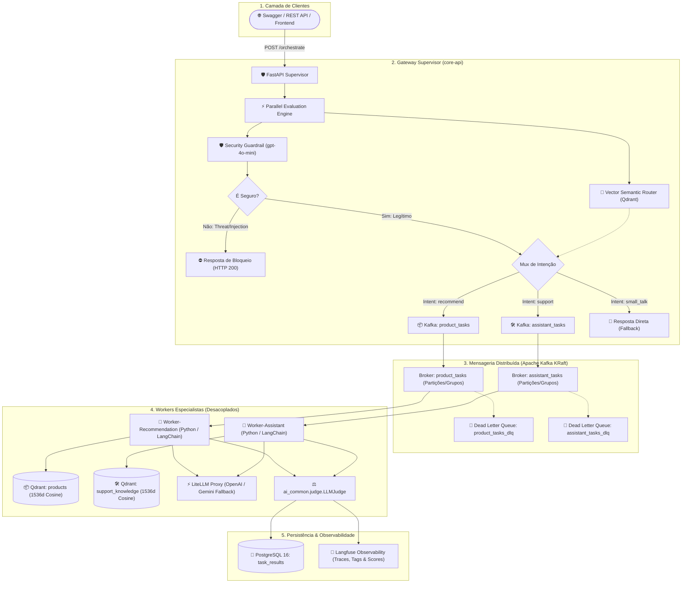

# 🏛️ Arquitetura Detalhada: Plataforma Multi-Agente Distribuída

Este documento detalha o desenho arquitetural, decisões de engenharia, padrões de resiliência e modelo de dados adotados na plataforma.

---

## 1. Topologia e Visão Geral do Sistema

A solução implementa o padrão **Supervisor + Especialistas Desacoplados (Worker Agents)** orientado a eventos (**Event-Driven**) usando **Apache Kafka** e **Qdrant**:



---

## 2. Decisões Arquiteturais Chave

### 2.1 Roteamento Semântico Vetorial Ultra-Rápido
- **Problema:** Chamadas sequenciais de LLMs pesados (`gpt-4o`) para Guardrail e Classificação de Intenções geravam ~3.2 segundos de latência.
- **Solução:** 
  1. Criação do índice vetorial de rotas `routes_index` no **Qdrant**.
  2. Embeddings pré-computados dos protótipos de intenção.
  3. Execução concorrente (`asyncio.gather`) do **Guardrail com `gpt-4o-mini`** e do **Roteador Vetorial no Qdrant**.
- **Resultado:** Decisão e retorno de `task_id` em **~800ms a 1.2s** (queda de mais de 60% no tempo de resposta).

### 2.2 Desacoplamento via Pacote Compartilhado (`packages/ai_common`)
Para evitar monólitos rígidos ou replicação de código entre microsserviços, a infraestrutura comum foi isolada no `packages/ai_common`:
- `ai_common.db`: Modelos e conexões PostgreSQL.
- `ai_common.kafka`: Produtor assíncrono, consumidor base resiliente e produtor DLQ.
- `ai_common.qdrant`: Gerenciamento de coleções e roteamento vetorial.
- `ai_common.judge`: `LLMJudge` padronizado contra alucinações.
- `ai_common.telemetry`: Gerenciador de traces, tags e scores do Langfuse.

### 2.3 Resiliência e Tolerância a Falhas
1. **Exponential Backoff Retries:** Se um worker falhar temporariamente ao contatar LLMs ou bancos, ele tenta até 3 vezes com espaçamento exponencial (1s, 2s, 4s).
2. **Dead Letter Queue (DLQ):** Tarefas que falham em todas as tentativas são enviadas para os tópicos de DLQ (`product_tasks_dlq`, `assistant_tasks_dlq`) para análise forense, sem bloquear o fluxo da fila principal.
3. **Graceful Shutdown (SIGTERM/SIGINT):** Ao receber sinal de encerramento do Docker/Kubernetes, os workers concluem a mensagem atual, fecham conexões do Kafka, dão flush no Langfuse e encerram de forma limpa.

---

## 3. Modelo de Dados Relacional & Vetorial

### 3.1 PostgreSQL (Relacional)
Gerenciado via **Alembic** em `migrations/`:
- **`products`**: ID, nome, descrição técnica e preço unitário.
- **`support_tickets`**: ID, número de ticket (`TCK-xxx`), categoria (`defeito`, `garantia`, `troca`), título, descrição e guia de solução.
- **`task_results`**: ID da tarefa (`task_id`), query original, status (`processing`, `completed`, `failed`), resposta gerada pelo agente e timestamps.

### 3.2 Qdrant (Vetorial)
- **`products`**: Vetores de produtos (1536 dimensões, Cosine Distance).
- **`support_knowledge`**: Vetores de manuais técnicos e histórico de tickets.
- **`routes_index`**: Vetores de classificação de intenções do Supervisor.

---

## 4. Governança e LLMOps

```
[ Resposta Candidata GPT-4o ] + [ Contexto Real Qdrant ]
                     │
                     ▼
        [ ⚖️ LLM-as-a-Judge ]
                     │
     ┌───────────────┴───────────────┐
     ▼                               ▼
 [ PASS ✅ ]                     [ FAIL ❌ (Alucinação) ]
  • Envia ao Cliente              • Descarta texto do LLM
  • Tag: judge_pass               • Tag: hallucination, judge_fail
  • Score: 1.0                    • Score: 0.0
  • Salva no Postgres             • Retorna Mensagem de Contingência
```
